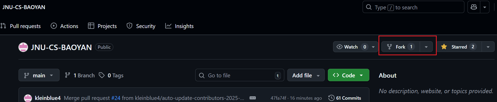
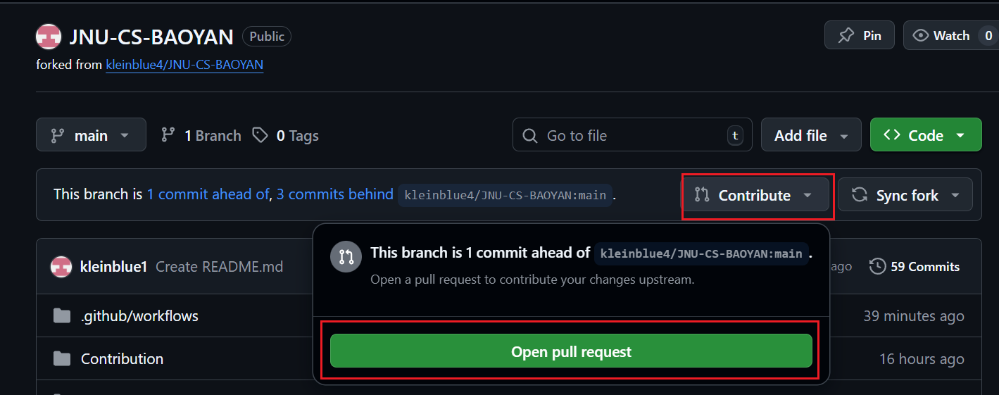
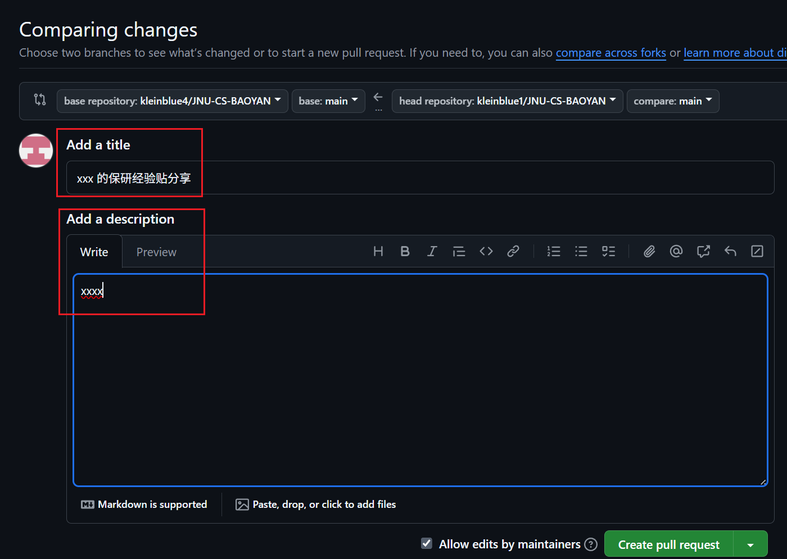

# 拉取请求（PR）提交指南

为确保我们项目的格式和内容一致性，请按照以下步骤通过 GitHub Web 界面分享您的经验贴。😊

## 📋 概述

本指南介绍了通过在 `SummerCamp` 或 `YuTuiMian` 目录下添加 README.md 文件来分享夏令营或预推免经验贴的流程。您可以选择撰写新的经验贴，或链接到已在其他平台发布的经验贴以节省时间。

---

## 🛠 步骤 1：Fork 仓库

1. **访问 GitHub 仓库**\
   打开项目在 GitHub 上的页面，在右上角点击 `Fork` 按钮，创建一个属于自己的该项目副本



2. **创建新文件夹和 README 文件**
   - 在 Fork 的项目副本中，根据所分享的经验贴类型，在对应的文件夹(SummerCamp / YuTuiMian)中的相应年份下创建经验贴文件夹。
   - 创建的经验贴文件名请符合规范，例如：`czs/README.md`（`czs` 为您的文件夹名，可以使用姓名缩写或自己的 GitHub 用户名）。
   - 注意：markdown 文件务必以 README （大写）命名，否则工作流可能无法通过。此外请确保文件夹名专业且相关，避免使用不雅或过于随意的名称。😅

---

## ✍️ 步骤 2：撰写经验贴

1. **撰写经验贴**\
   在编辑器中撰写您的经验贴内容，建议：
   - 可以使用提供的 [模板](./Template.md)，或自行设计清晰的 Markdown 格式。
   - 确保内容简洁、有条理，对其他用户有帮助。
   - 示例结构：
     ```markdown
     # <您的名字或其他昵称> 的夏令营经验贴
     ## 背景
     [介绍您的背景，如学校、专业等]
     ## 经历
     [描述您的夏令营经历]
     ## 建议
     [提供对其他人的建议]
     ```

2. **链接现有内容（可选）**\
   如果您已在其他平台（如博客、知乎）发布过经验贴，可以在 `README.md` 中添加链接，例如：
   ```markdown
   本经验贴已发布在：[链接标题](URL)
   ```

---

## 📸 步骤 3：添加相关文件（可选）

1. **上传图片或其他文件**\
   如果您的经验贴需要附加图片或其他文件：
   - 导航到您的文件夹（例如 `SummerCamp/2025/czs/`）。
   - 创建 `asset` 文件夹用于存放相关文件或图片
   - 确保文件命名清晰（如 `figure1.jpg`），并在 `README.md` 中引用，例如：
     ```markdown
     
     ```

2. **注意事项**\
   - 尽量压缩图片和文件以减少文件大小。
   - 如需要上传的文件过大，建议可以自己创建一个独立仓库来存放经验贴，然后在 README 中引用该仓库连接

---

## 🚀 步骤 3：提交拉取请求（PR）

1. **创建新分支并提交 PR**\
   - 在完成经验贴的撰写后，点击副本仓库主界面的 `Contribute` 下的 `Open pull request` 来提交 PR




2. **填写 PR 信息**\
   - 在 PR 标题中简要描述您的贡献，例如：“添加 xxx 的夏令营经验贴”。
   - 在描述中说明您的经验贴内容（如目录、主题等）。
   - 完成后点击`Create pull request`提交 PR，等待审核。



---

## 🔍 步骤 4：审核与更新

1. **提交审核**\
   您的 PR 将由维护者审核。如果内容符合要求，将被合并到 `main` 分支，您的分支将被删除。

2. **后续更新**\
   如果需要修改您的经验贴：
   - 在自己 Fork 的仓库下，点击 `Sync fork` 按钮下的 `Update branch`，即可将仓库内容更新到最新版本。
   - 在最新版的项目中修改或更新相应文件。
   - 修改内容后，提交新的 PR ，参照步骤 1-3 。
   - 或者联系维护者，说明需要更新的内容。

---

## 💡 小贴士

- **命名规范**：文件夹和文件名请保持专业且相关，例如 `czs/README.md` 或 `klein/README.md`。
- **内容质量**：确保经验贴清晰、简洁且对他人有帮助，检查 Markdown 格式是否正确（可在 GitHub 预览）。
- **文件管理**：上传图片时，建议使用描述性文件名，并确保在 README 中正确引用。
- **遇到问题**：如有疑问或技术问题，请联系维护者！

感谢您为我们的项目做出贡献！🎉

如果有任何疑问，请 [issue](https://github.com/kleinblue4/JNU-CS-BAOYAN/issues) 问题或邮件联系：a2194037898@163.com
